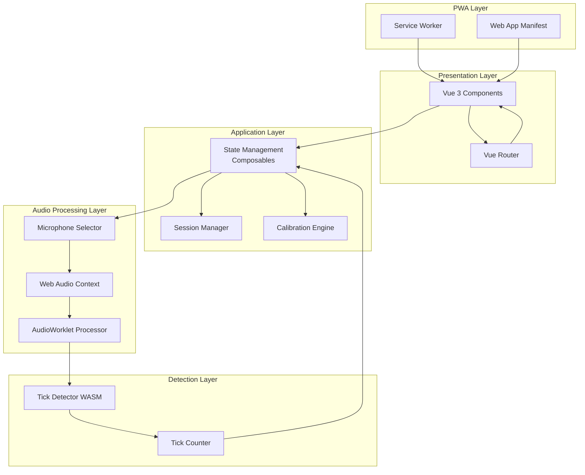
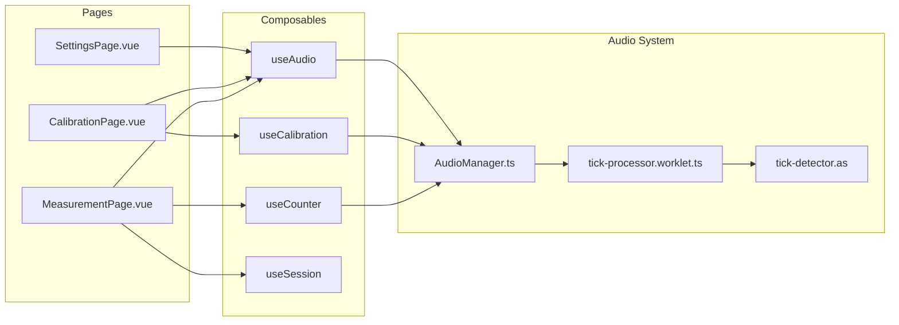
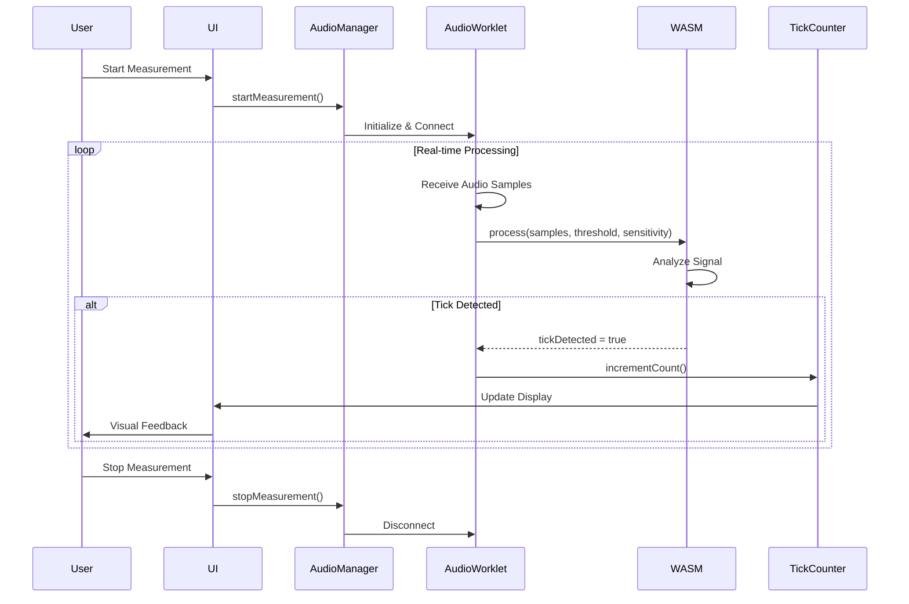

# Design Document: Tick Tack Timer PWA

## Overview

Tick Tack Timer is a Progressive Web Application that detects and counts mechanical clock ticks in real-time using advanced audio processing. The application leverages Web Audio API's AudioWorklet for low-latency audio processing and WebAssembly (compiled from AssemblyScript) for high-performance tick detection algorithms.

The system architecture separates concerns into distinct layers:
- **Presentation Layer**: Vue 3 components with Composition API for reactive UI
- **Audio Processing Layer**: AudioWorklet running in a dedicated thread for real-time audio analysis
- **Detection Layer**: WASM module for computationally intensive tick detection
- **State Management Layer**: Vue composables for application state and session management
- **PWA Layer**: Service worker for offline capabilities and installability

The application provides three main user flows:
1. **Settings Flow**: Configure audio input source (internal/external microphone)
2. **Calibration Flow**: Adjust sensitivity and threshold based on clock size (small/medium/large)
3. **Measurement Flow**: Real-time tick detection, counting, and visual feedback

Key design decisions:
- AudioWorklet over ScriptProcessorNode for guaranteed low-latency processing
- WASM for tick detection to achieve sub-millisecond analysis performance
- Composition API for better code organization and reusability
- Standard CSS to minimize bundle size and maintain PWA performance
- GitHub Pages deployment with custom domain support

## Architecture

### System Architecture



### Component Architecture



### Data Flow



## Components and Interfaces

### Vue Components

#### SettingsPage.vue
**Purpose**: Configure audio input source selection

**Props**: None

**Emits**: None

**State**:
- `selectedMicrophone: Ref<string>` - Currently selected microphone device ID
- `availableMicrophones: Ref<MediaDeviceInfo[]>` - List of available audio input devices

**Methods**:
- `selectMicrophone(deviceId: string): void` - Set active microphone
- `refreshDevices(): Promise<void>` - Re-enumerate audio devices

**Dependencies**: `useAudio` composable

---

#### CalibrationPage.vue
**Purpose**: Calibrate tick detection for specific clock size

**Props**: None

**Emits**: None

**State**:
- `clockSize: Ref<'small' | 'medium' | 'large'>` - Selected clock size
- `isCalibrating: Ref<boolean>` - Calibration in progress flag
- `detectedTicks: Ref<number>` - Ticks detected during calibration
- `calibrationStatus: Ref<string>` - Status message for user

**Methods**:
- `startCalibration(size: ClockSize): Promise<void>` - Begin calibration process
- `stopCalibration(): void` - Cancel calibration
- `completeCalibration(): void` - Finalize and save calibration settings

**Dependencies**: `useCalibration`, `useAudio` composables

---

#### MeasurementPage.vue
**Purpose**: Display real-time tick counting and visual feedback

**Props**: None

**Emits**: None

**State**:
- `tickCount: Ref<number>` - Current tick count
- `sessionDuration: Ref<number>` - Elapsed time in seconds
- `isActive: Ref<boolean>` - Measurement session active flag
- `lastTickTime: Ref<number>` - Timestamp of last detected tick
- `isIdle: Ref<boolean>` - No ticks detected for 5+ seconds

**Methods**:
- `startSession(): void` - Begin new measurement session
- `stopSession(): void` - End current session
- `resetSession(): void` - Clear count and duration

**Dependencies**: `useCounter`, `useSession`, `useAudio` composables

---

### Composables

#### useAudio
**Purpose**: Manage Web Audio API, microphone selection, and AudioWorklet lifecycle

**Interface**:
```typescript
interface UseAudio {
  // State
  audioContext: Ref<AudioContext | null>
  selectedDevice: Ref<string | null>
  availableDevices: Ref<MediaDeviceInfo[]>
  isInitialized: Ref<boolean>
  permissionGranted: Ref<boolean>
  
  // Methods
  requestPermission(): Promise<boolean>
  enumerateDevices(): Promise<MediaDeviceInfo[]>
  selectDevice(deviceId: string): Promise<void>
  initializeWorklet(): Promise<void>
  startProcessing(): void
  stopProcessing(): void
  cleanup(): void
}
```

**Responsibilities**:
- Request and manage microphone permissions
- Enumerate and select audio input devices
- Initialize AudioContext and AudioWorklet
- Load and instantiate WASM module
- Manage audio stream lifecycle
- Persist device selection to localStorage

---

#### useCalibration
**Purpose**: Handle calibration logic and parameter adjustment

**Interface**:
```typescript
interface UseCalibration {
  // State
  clockSize: Ref<ClockSize>
  sensitivity: Ref<number>
  threshold: Ref<number>
  isCalibrating: Ref<boolean>
  calibrationProgress: Ref<number>
  
  // Methods
  startCalibration(size: ClockSize): Promise<void>
  stopCalibration(): void
  saveCalibration(): void
  loadCalibration(): CalibrationSettings | null
  resetCalibration(): void
}
```

**Responsibilities**:
- Manage calibration state machine
- Calculate optimal sensitivity and threshold from sample ticks
- Persist calibration settings to localStorage
- Provide calibration progress feedback
- Validate calibration completion criteria (minimum 10 ticks)

---

#### useCounter
**Purpose**: Maintain tick count and provide real-time updates

**Interface**:
```typescript
interface UseCounter {
  // State
  count: Ref<number>
  lastTickTimestamp: Ref<number>
  isIdle: Ref<boolean>
  
  // Methods
  increment(): void
  reset(): void
  getCount(): number
}
```

**Responsibilities**:
- Increment count on tick detection
- Track last tick timestamp for idle detection
- Provide reactive count updates to UI
- Reset count for new sessions

---

#### useSession
**Purpose**: Manage measurement session lifecycle and timing

**Interface**:
```typescript
interface UseSession {
  // State
  isActive: Ref<boolean>
  duration: Ref<number>
  startTime: Ref<number | null>
  
  // Methods
  start(): void
  stop(): void
  reset(): void
  getDuration(): number
}
```

**Responsibilities**:
- Track session start/stop state
- Calculate elapsed duration
- Manage session timer
- Handle session confirmation prompts

---

### Audio Processing Components

#### AudioManager.ts
**Purpose**: Coordinate audio system initialization and communication

**Interface**:
```typescript
class AudioManager {
  private audioContext: AudioContext | null
  private workletNode: AudioWorkletNode | null
  private mediaStream: MediaStream | null
  private sourceNode: MediaStreamAudioSourceNode | null
  
  async initialize(deviceId?: string): Promise<void>
  async loadWorklet(): Promise<void>
  async loadWasm(): Promise<WebAssembly.Module>
  setCalibration(sensitivity: number, threshold: number): void
  start(): void
  stop(): void
  onTickDetected(callback: () => void): void
  cleanup(): void
}
```

**Responsibilities**:
- Initialize Web Audio API components
- Load AudioWorklet processor script
- Load and instantiate WASM module
- Connect audio graph (MediaStream → AudioWorklet)
- Forward tick detection events to application layer
- Handle cleanup and resource disposal

---

#### tick-processor.worklet.ts
**Purpose**: AudioWorklet processor for real-time audio analysis

**Interface**:
```typescript
class TickProcessorWorklet extends AudioWorkletProcessor {
  private wasmInstance: WebAssembly.Instance
  private sensitivity: number
  private threshold: number
  private lastTickTime: number
  
  constructor(options: AudioWorkletNodeOptions)
  process(
    inputs: Float32Array[][],
    outputs: Float32Array[][],
    parameters: Record<string, Float32Array>
  ): boolean
  
  // Message handlers
  private handleSetCalibration(data: CalibrationData): void
  private handleSetWasm(wasmModule: WebAssembly.Module): void
}
```

**Responsibilities**:
- Process audio samples in 128-sample blocks
- Pass samples to WASM tick detector
- Apply 50ms duplicate detection window
- Post tick detection messages to main thread
- Maintain low-latency processing (<100ms)

---

#### tick-detector.as (AssemblyScript/WASM)
**Purpose**: High-performance tick detection algorithm

**Interface**:
```typescript
// AssemblyScript exports
export function detectTick(
  samples: Float32Array,
  sampleCount: i32,
  threshold: f32,
  sensitivity: f32
): bool

export function calculateRMS(samples: Float32Array, sampleCount: i32): f32
export function applyHighPassFilter(samples: Float32Array, sampleCount: i32): void
```

**Responsibilities**:
- Calculate RMS (Root Mean Square) of audio samples
- Apply high-pass filter to remove low-frequency noise
- Compare signal strength against threshold
- Apply sensitivity scaling
- Return boolean tick detection result

**Algorithm**:
1. Apply high-pass filter (cutoff ~500Hz) to isolate tick frequencies
2. Calculate RMS of filtered samples
3. Compare RMS against `threshold * sensitivity`
4. Return true if threshold exceeded

---

### PWA Components

#### Service Worker (sw.ts)
**Purpose**: Enable offline functionality and PWA installation

**Responsibilities**:
- Cache application assets on install
- Serve cached assets when offline
- Implement cache-first strategy for static resources
- Update cache on new version deployment

**Caching Strategy**:
- **App Shell**: Cache HTML, CSS, JS, WASM files
- **Runtime**: Cache audio worklet scripts
- **Network First**: API calls (if any future features require)

---

#### Web App Manifest (manifest.json)
**Purpose**: Define PWA metadata and installation behavior

**Configuration**:
```json
{
  "name": "Tick Tack Timer",
  "short_name": "TickTack",
  "description": "Real-time mechanical clock tick counter",
  "start_url": "/",
  "display": "standalone",
  "background_color": "#ffffff",
  "theme_color": "#2c3e50",
  "orientation": "any",
  "icons": [
    {
      "src": "/icons/icon-192.png",
      "sizes": "192x192",
      "type": "image/png"
    },
    {
      "src": "/icons/icon-512.png",
      "sizes": "512x512",
      "type": "image/png"
    }
  ]
}
```

## Data Models

### CalibrationSettings
**Purpose**: Store calibration parameters for tick detection

```typescript
interface CalibrationSettings {
  clockSize: 'small' | 'medium' | 'large'
  sensitivity: number        // Range: 0.1 - 2.0
  threshold: number          // Range: 0.01 - 0.5 (RMS amplitude)
  expectedFrequency: number  // Expected ticks per second
  calibratedAt: number       // Timestamp of calibration
}
```

**Storage**: localStorage key `tick-tack-calibration`

**Default Values**:
- Small clock: sensitivity=1.2, threshold=0.05, frequency=2.0
- Medium clock: sensitivity=1.0, threshold=0.08, frequency=1.5
- Large clock: sensitivity=0.8, threshold=0.12, frequency=1.0

---

### SessionData
**Purpose**: Track measurement session information

```typescript
interface SessionData {
  id: string                 // UUID
  startTime: number          // Unix timestamp
  endTime: number | null     // Unix timestamp or null if active
  tickCount: number          // Total ticks detected
  duration: number           // Duration in seconds
  clockSize: ClockSize       // Clock size used
  microphone: string         // Device ID or 'internal'
}
```

**Storage**: localStorage key `tick-tack-session` (current session only)

---

### AudioDeviceInfo
**Purpose**: Represent available audio input device

```typescript
interface AudioDeviceInfo {
  deviceId: string           // Unique device identifier
  label: string              // Human-readable device name
  kind: 'audioinput'         // MediaDeviceInfo kind
  isDefault: boolean         // System default device flag
  isExternal: boolean        // USB-C contact microphone flag
}
```

**Derived from**: MediaDeviceInfo Web API

---

### TickEvent
**Purpose**: Represent a detected tick event

```typescript
interface TickEvent {
  timestamp: number          // High-resolution timestamp (performance.now())
  amplitude: number          // RMS amplitude of detected tick
  confidence: number         // Detection confidence (0-1)
}
```

**Usage**: Internal to AudioWorklet, not persisted

---

### AppState
**Purpose**: Global application state

```typescript
interface AppState {
  // Audio state
  audioInitialized: boolean
  permissionGranted: boolean
  selectedDeviceId: string | null
  
  // Calibration state
  calibrationSettings: CalibrationSettings | null
  isCalibrated: boolean
  
  // Session state
  currentSession: SessionData | null
  isSessionActive: boolean
  
  // UI state
  currentPage: 'settings' | 'calibration' | 'measurement'
  errorMessage: string | null
}
```

**Storage**: Combination of reactive refs in composables and localStorage

---

### ErrorInfo
**Purpose**: Structured error information for user display

```typescript
interface ErrorInfo {
  code: ErrorCode
  message: string
  details: string
  resolution: string[]       // Steps to resolve
  timestamp: number
}

enum ErrorCode {
  MICROPHONE_PERMISSION_DENIED = 'MIC_PERMISSION_DENIED',
  MICROPHONE_ACCESS_FAILED = 'MIC_ACCESS_FAILED',
  AUDIOWORKLET_INIT_FAILED = 'WORKLET_INIT_FAILED',
  WASM_LOAD_FAILED = 'WASM_LOAD_FAILED',
  CALIBRATION_TIMEOUT = 'CALIBRATION_TIMEOUT',
  BROWSER_NOT_SUPPORTED = 'BROWSER_NOT_SUPPORTED'
}
```

**Usage**: Error handling and user feedback


## Correctness Properties

*A property is a characteristic or behavior that should hold true across all valid executions of a system—essentially, a formal statement about what the system should do. Properties serve as the bridge between human-readable specifications and machine-verifiable correctness guarantees.*

### Property 1: Microphone selection activation

*For any* audio input source selected by the user, the system should activate that specific microphone device and make it the active audio source.

**Validates: Requirements 1.2**

### Property 2: External microphone enumeration

*For any* external microphone connected to the device, the microphone selector should detect it and include it in the list of available audio input devices.

**Validates: Requirements 1.3**

### Property 3: Microphone selection persistence

*For any* microphone device selection, saving the selection and then reloading the application should restore the same device as the active selection.

**Validates: Requirements 1.5**

### Property 4: Clock size frequency adjustment

*For any* clock size selection (small, medium, or large), the calibration engine should set the expected tick frequency to the value corresponding to that clock size.

**Validates: Requirements 2.2**

### Property 5: Calibration parameter computation

*For any* audio input received during active calibration, the calibration engine should analyze the samples and compute sensitivity and threshold values.

**Validates: Requirements 2.3**

### Property 6: Calibration settings persistence

*For any* completed calibration with computed sensitivity and threshold values, storing the calibration and then loading it should return the same sensitivity and threshold values.

**Validates: Requirements 2.4**

### Property 7: Calibration visual feedback

*For any* tick detected during calibration, the calibration interface should update to display the detection within the same render cycle.

**Validates: Requirements 2.5**

### Property 8: Non-blocking audio processing

*For any* audio processing operation, the main thread should remain responsive and capable of handling user interactions without blocking.

**Validates: Requirements 3.2**

### Property 9: Audio sample forwarding

*For any* audio samples received by the audio processor, those samples should be passed to the WASM tick detector module for analysis.

**Validates: Requirements 3.3**

### Property 10: Threshold-based tick identification

*For any* audio sample with RMS amplitude exceeding the calibrated threshold, the tick detector should identify it as a potential tick event.

**Validates: Requirements 4.1**

### Property 11: Sensitivity-based noise filtering

*For any* audio sample with amplitude below the sensitivity threshold, the tick detector should filter it out and not identify it as a tick event.

**Validates: Requirements 4.2**

### Property 12: Tick event notification

*For any* confirmed tick event detected by the tick detector, the tick counter should be notified and receive the event.

**Validates: Requirements 4.3**

### Property 13: Duplicate tick prevention

*For any* tick detected at time T, any subsequent detections within the time window [T, T+50ms] should be ignored as duplicates.

**Validates: Requirements 4.4**

### Property 14: Tick count accuracy

*For any* sequence of N tick events detected during a session, the tick counter should display a count equal to N.

**Validates: Requirements 5.1, 5.5**

### Property 15: Real-time count display

*For any* change in the tick count value, the measurement page display should update to show the new count value.

**Validates: Requirements 5.2**

### Property 16: Session initialization resets counter

*For any* new measurement session started, the tick counter should reset to zero at the moment the session begins.

**Validates: Requirements 5.3, 13.2**

### Property 17: Navigation state preservation

*For any* application state and any navigation between pages, the application state should remain unchanged after navigation completes.

**Validates: Requirements 7.4**

### Property 18: Navigation controls availability

*For any* page in the application, navigation controls should be present and functional to allow movement to other pages.

**Validates: Requirements 7.2**

### Property 19: Microphone permission activation

*For any* granted microphone permission, the system should activate the selected audio input source and begin receiving audio data.

**Validates: Requirements 8.3**

### Property 20: Error logging

*For any* error that occurs in the application, error details should be logged to the console or error tracking system.

**Validates: Requirements 14.4**

### Property 21: Graceful degradation

*For any* non-critical component failure, the application should continue operating with remaining functional components.

**Validates: Requirements 14.5**

### Property 22: Responsive rendering

*For any* screen width between 320 and 768 pixels, the application should render all UI elements correctly without overflow or layout breaks.

**Validates: Requirements 15.1**

### Property 23: Touch target sizing

*For any* interactive control in the application, the tap target size should be at least 44 pixels in both width and height.

**Validates: Requirements 15.2**

### Property 24: Orientation adaptation

*For any* orientation change between portrait and landscape, the application layout should adapt to fit the new orientation appropriately.

**Validates: Requirements 15.3**

### Property 25: Text readability

*For any* text element in the application, the font size should be at least 16 pixels to ensure readability without zooming on mobile devices.

**Validates: Requirements 15.4**

### Property 26: Intentional navigation

*For any* navigation action, it should require a deliberate user gesture (tap or swipe) and not trigger from accidental touches.

**Validates: Requirements 15.5**

### Property 27: Tick detection visual feedback

*For any* tick event detected during measurement, the measurement page should provide visual feedback indicating the detection.

**Validates: Requirements 11.1**

### Property 28: Idle state indication

*For any* time period of 5 consecutive seconds without tick detection, the measurement page should display an idle state indicator.

**Validates: Requirements 11.5**

### Property 29: Calibration tick display

*For any* tick detected during calibration, the calibration page should update the display to show the detected tick count.

**Validates: Requirements 12.1**

### Property 30: Calibration completion indication

*For any* calibration session where the minimum required tick samples are collected, the calibration engine should indicate completion status.

**Validates: Requirements 12.2**

### Property 31: Calibration success enables navigation

*For any* successfully completed calibration, navigation to the measurement page should become enabled.

**Validates: Requirements 12.5**

### Property 32: Session stop preserves count

*For any* measurement session that is stopped, the final tick count should remain accessible for review after the session ends.

**Validates: Requirements 13.3**

## Error Handling

The application implements a comprehensive error handling strategy with specific error types, user-friendly messages, and recovery mechanisms.

### Error Categories

#### Permission Errors
- **Microphone Permission Denied (8.2)**: When the user denies microphone access, display a modal explaining that audio input is required for tick detection, with a button to retry the permission request.
- **Permission Revoked During Operation (8.4)**: If microphone access is revoked while measuring, immediately pause tick detection, display a notification banner, and provide a button to request permission again.

#### Initialization Errors
- **AudioWorklet Initialization Failure (3.5)**: If AudioWorklet fails to initialize, display an error message indicating browser compatibility issues with a link to supported browsers (Chrome 66+, Edge 79+, Safari 14.1+).
- **WASM Module Load Failure (14.3)**: If the WASM module fails to load, display an error message and automatically attempt to reload the module once. If the second attempt fails, suggest refreshing the page.
- **Audio Context Creation Failure (14.1)**: If Web Audio API is unavailable, display a browser compatibility error with recommendations to update the browser.

#### Calibration Errors
- **Calibration Timeout (12.4)**: If no ticks are detected within 30 seconds during calibration, display a prompt suggesting the user check microphone placement, increase volume, or move the microphone closer to the clock.
- **Insufficient Calibration Samples (12.3)**: Prevent calibration completion if fewer than 10 ticks are detected. Display the current count and required count.

#### Runtime Errors
- **Audio Stream Interruption**: If the audio stream is interrupted (e.g., device disconnected), pause measurement, display a notification, and attempt to reconnect when the device becomes available.
- **Worklet Processing Error**: If the AudioWorklet encounters a processing error, log the error details and attempt to restart the worklet. If restart fails, fall back to degraded mode without real-time processing.

### Error Display Strategy

All errors follow a consistent display pattern:
1. **Error Icon**: Visual indicator of error severity (warning, error, critical)
2. **Error Title**: Brief description of what went wrong
3. **Error Message**: User-friendly explanation in plain language
4. **Resolution Steps**: Numbered list of actions the user can take
5. **Action Buttons**: Primary action (e.g., "Retry", "Grant Permission") and secondary action (e.g., "Learn More")

### Error Recovery

The application implements automatic recovery where possible:
- **Transient Errors**: Automatically retry with exponential backoff (e.g., WASM loading, audio stream reconnection)
- **Permission Errors**: Provide clear UI to re-request permissions
- **Degraded Mode**: Continue operating with reduced functionality when non-critical components fail (e.g., disable visual feedback if rendering fails, but continue counting)

### Error Logging

All errors are logged with structured data:
```typescript
{
  timestamp: number,
  errorCode: ErrorCode,
  message: string,
  stack: string,
  context: {
    page: string,
    userAgent: string,
    audioDevices: string[],
    calibrationState: object
  }
}
```

Logs are stored in localStorage (last 50 errors) and can be exported for debugging.

## Testing Strategy

The Tick Tack Timer application requires a dual testing approach combining unit tests for specific scenarios and property-based tests for comprehensive coverage of the correctness properties defined above.

### Testing Framework Selection

- **Unit Testing**: Vitest (fast, Vite-native, excellent TypeScript support)
- **Property-Based Testing**: fast-check (mature JavaScript PBT library, 100+ generators)
- **Component Testing**: @vue/test-utils with Vitest
- **E2E Testing**: Playwright (for PWA installation and offline functionality)

### Property-Based Testing Configuration

Each property test must:
1. Run a minimum of 100 iterations to ensure comprehensive input coverage
2. Include a comment tag referencing the design property: `// Feature: tick-tack-timer, Property N: [property text]`
3. Use appropriate generators from fast-check to create random test inputs
4. Verify the universal property holds for all generated inputs

Example property test structure:
```typescript
import fc from 'fast-check';

// Feature: tick-tack-timer, Property 3: Microphone selection persistence
test('microphone selection persists across sessions', () => {
  fc.assert(
    fc.property(
      fc.string(), // Generate random device IDs
      (deviceId) => {
        // Save selection
        saveMicrophoneSelection(deviceId);
        
        // Simulate app reload
        clearRuntimeState();
        
        // Load selection
        const loaded = loadMicrophoneSelection();
        
        // Verify round-trip
        expect(loaded).toBe(deviceId);
      }
    ),
    { numRuns: 100 }
  );
});
```

### Unit Testing Strategy

Unit tests complement property tests by focusing on:

1. **Specific Examples**: Test concrete scenarios that demonstrate correct behavior
   - Example: Test that selecting "small" clock size sets frequency to 2.0 Hz
   - Example: Test that the measurement page is the default route

2. **Edge Cases**: Test boundary conditions and special cases
   - Example: Test behavior when no external microphone is connected (1.4)
   - Example: Test calibration with exactly 10 ticks (minimum threshold)
   - Example: Test idle state after exactly 5 seconds without ticks

3. **Error Conditions**: Test specific error scenarios
   - Example: Test AudioWorklet initialization failure displays compatibility message (3.5)
   - Example: Test microphone permission denial shows explanation (8.2)
   - Example: Test WASM load failure triggers retry (14.3)

4. **Integration Points**: Test component interactions
   - Example: Test that AudioManager correctly initializes AudioWorklet and WASM
   - Example: Test that tick events flow from worklet to counter to UI

### Test Organization

```
tests/
├── unit/
│   ├── components/
│   │   ├── SettingsPage.spec.ts
│   │   ├── CalibrationPage.spec.ts
│   │   └── MeasurementPage.spec.ts
│   ├── composables/
│   │   ├── useAudio.spec.ts
│   │   ├── useCalibration.spec.ts
│   │   ├── useCounter.spec.ts
│   │   └── useSession.spec.ts
│   ├── audio/
│   │   ├── AudioManager.spec.ts
│   │   └── tick-detector.spec.ts
│   └── utils/
│       └── error-handling.spec.ts
├── property/
│   ├── microphone-selection.property.spec.ts
│   ├── calibration.property.spec.ts
│   ├── tick-detection.property.spec.ts
│   ├── tick-counting.property.spec.ts
│   ├── navigation.property.spec.ts
│   └── responsive-design.property.spec.ts
└── e2e/
    ├── pwa-installation.spec.ts
    ├── offline-functionality.spec.ts
    └── full-workflow.spec.ts
```

### WASM Testing

The AssemblyScript tick detector requires special testing considerations:

1. **Unit Tests**: Test WASM functions directly using AssemblyScript's testing tools
   - Test RMS calculation with known audio samples
   - Test high-pass filter with various frequencies
   - Test threshold detection with samples above/below threshold

2. **Property Tests**: Test WASM integration from JavaScript
   - Property: For any audio samples, WASM processing should complete without errors
   - Property: For any samples above threshold, detection should return true

### AudioWorklet Testing

AudioWorklet code runs in a separate thread and requires mocking:

1. **Mock AudioWorkletProcessor**: Create a test harness that simulates the AudioWorklet environment
2. **Test Message Passing**: Verify messages are correctly sent between worklet and main thread
3. **Test Audio Processing**: Feed synthetic audio samples and verify tick detection logic

### PWA Testing

PWA features require E2E testing:

1. **Manifest Validation**: Verify manifest.json contains all required fields (6.1)
2. **Service Worker Registration**: Verify service worker registers successfully (6.2)
3. **Offline Functionality**: Verify app loads and functions when offline (6.4)
4. **Installation**: Verify PWA can be installed on supported browsers (manual testing)

### Responsive Design Testing

Responsive behavior requires viewport testing:

1. **Unit Tests**: Test CSS media queries and responsive utilities
2. **Component Tests**: Render components at various viewport sizes (320px, 375px, 768px)
3. **Property Tests**: For any viewport width in range [320, 768], verify no layout overflow (Property 22)

### Continuous Integration

All tests run on every commit:
1. Unit tests and property tests run in parallel
2. E2E tests run on main branch merges
3. Coverage threshold: 80% for unit tests
4. All property tests must pass (100 iterations each)

### Test Data Generators

Custom fast-check generators for domain-specific types:

```typescript
// Generator for audio samples
const audioSamplesArb = fc.float32Array({
  minLength: 128,
  maxLength: 128,
  min: -1.0,
  max: 1.0
});

// Generator for calibration settings
const calibrationSettingsArb = fc.record({
  clockSize: fc.constantFrom('small', 'medium', 'large'),
  sensitivity: fc.float({ min: 0.1, max: 2.0 }),
  threshold: fc.float({ min: 0.01, max: 0.5 }),
  expectedFrequency: fc.float({ min: 0.5, max: 3.0 }),
  calibratedAt: fc.integer({ min: 0 })
});

// Generator for tick events
const tickEventArb = fc.record({
  timestamp: fc.float({ min: 0 }),
  amplitude: fc.float({ min: 0, max: 1 }),
  confidence: fc.float({ min: 0, max: 1 })
});
```

### Testing Anti-Patterns to Avoid

1. **Don't write too many unit tests**: Property tests handle comprehensive input coverage. Focus unit tests on specific examples and edge cases.
2. **Don't test implementation details**: Test behavior, not internal state or private methods.
3. **Don't mock excessively**: Use real implementations where possible; mock only external dependencies (Web APIs, browser features).
4. **Don't skip property tests**: Every correctness property must have a corresponding property-based test.

### Performance Testing

While not part of the core testing strategy, performance benchmarks should be established for:
- Audio processing latency (target: <100ms) - Requirement 3.4
- Display update latency (target: <50ms) - Requirements 5.4, 11.2
- Page navigation time (target: <200ms) - Requirement 7.3

These are measured separately using performance profiling tools rather than automated tests.
